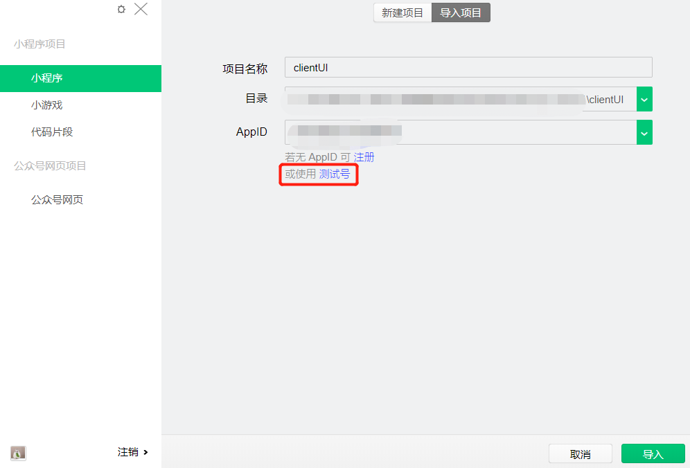
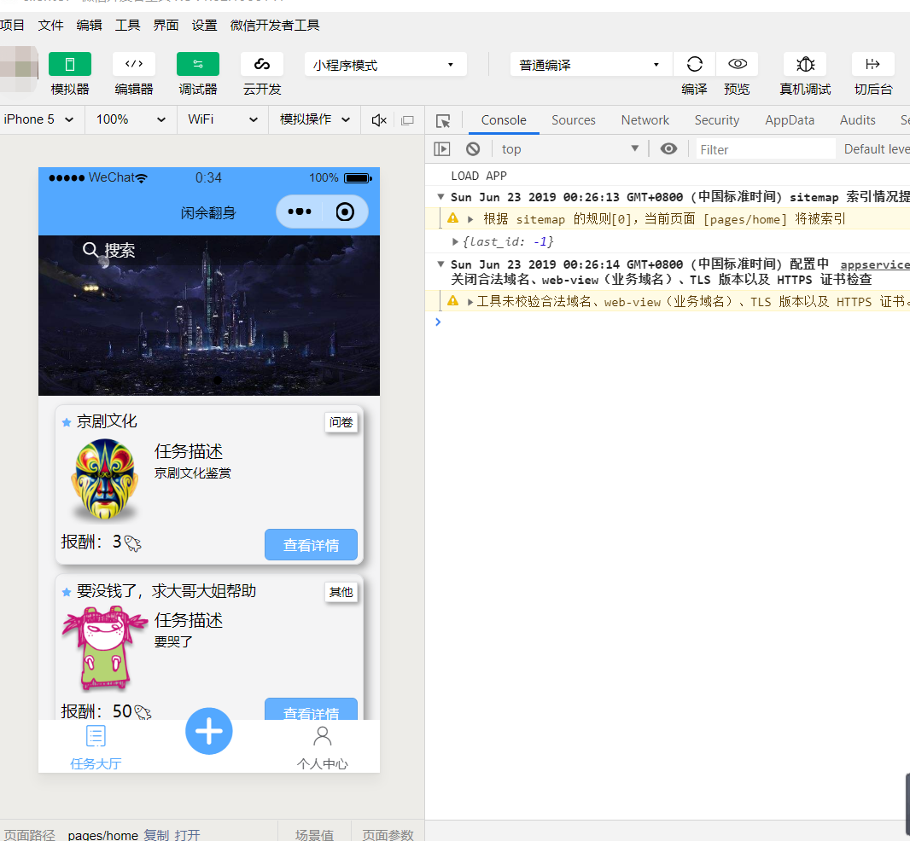
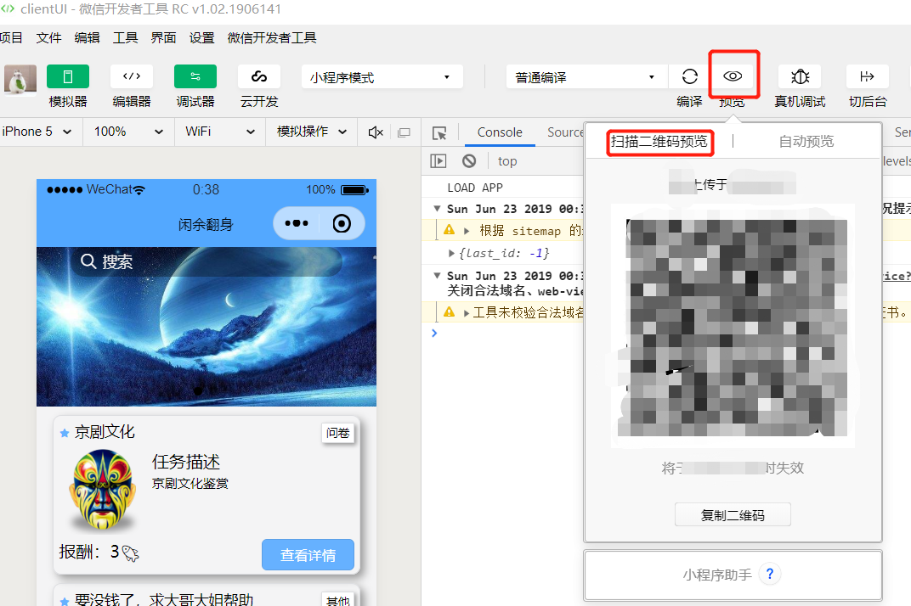
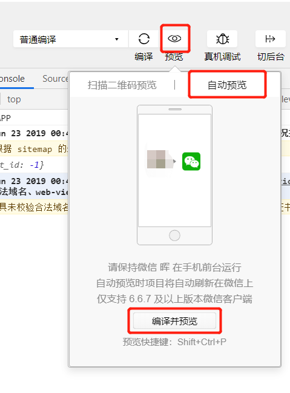

# clientUI
闲余翻身微信小程序前端

## **部署报告**

### **一、部署环境**
* Windows 10 / MacOs
* npm 6.4.1
* node v11.4.0
* wepy 1.7.3
* [微信开发者工具 1.02.1906141](https://developers.weixin.qq.com/miniprogram/dev/devtools/download.html)

### **二、部署步骤**
### **1. 安装（更新） wepy 命令行工具**。
	npm install wepy-cli -g
### **2. 安装微信开发者工具**
### **3. 从github上下载源代码**
### **4. 打开项目目录安装依赖包**
	npm install
### **5. 开发实时编译**
    wepy build --watch
### **6. 利用微信开发者工具打开项目**
    登录微信开发者工具，导入项目，使用测试号导入打开项目即可，如图

### **7. 生产压缩**
	npm run build //上传代码时，请先执行此命令，否则会提示包体积过大

### **8. 利用微信开发者工具进行预览**
* 利用微信开发者工具模拟器预览
    在开发者工具中点开模拟器，并编译，待编译完成后即可显示。

* 利用微信开发者工具生成二维码手机上预览
    在微信开发者工具中，点击 “预览 -> 扫描二维码预览/自动预览”，点击扫描二维码即可利用微信扫描二维码在微信中打开小程序，点击自动预览将会直接在关联的微信中打开小程序

利用二维码显示项目

自动预览项目

### **开发使用说明(重要)**

1、使用微信开发者工具-->添加项目，项目目录请选择dist目录。

2、微信开发者工具-->项目-->关闭ES6转ES5。 重要：漏掉此项会运行报错。 

3、微信开发者工具-->项目-->关闭上传代码时样式自动补全。  重要：某些情况下漏掉此项也会运行报错。 

4、微信开发者工具-->项目-->关闭代码压缩上传。  重要：开启后，会导致真机computed, props.sync 等等属性失效。 

5、 微信开发者工具-->项目-->详情-->本地设置-->不校验合法域名、web-view(业务域名)、TLS版本以及HTTPS证书，开启此选项，否则连接不到服务器端。

### **wepy开发文档地址**
	https://tencent.github.io/wepy/
### **目录结构**

    ├── src
        ├── app.wpy                 //入口文件
        ├── api                     //api接口
        ├── components              //自定义组件
        ├── images                  //图片文件夹
        ├── pages                   //页面
        │   ├── answerquestion.wpy  //问卷回答
        │   ├── authorize.wpy       //授权页面
        │   ├── completetask.wpy    //完成任务
        │   ├── createtask.wpy      //创建任务
        |   ├── detail.wpy          //任务详情页面
        |   ├── edit-user-info.wpy  //用户信息修改界面
        |   ├── favorite.wpy            
        |   ├── home.wpy            //主界面
        |   ├── login.wpy           //登录页面
        |   ├── message.wpy         //消息页面 (未写)
        |   ├── mypublish.wpy       //我发布的页面
        |   ├── mytask.wpy          //我的任务
        |   ├── point.wpy           //积分信息显示
        |   ├── profile.wpy         //我页面
        |   ├── question.wpy        //问卷发布页面
        |   ├── recharge.wpy        //充值页面
        |   ├── register.wpy        //注册页面
        |   ├── search.wpy          //搜索页面
        |   ├── setpass.wpy         //修改密码
        |   ├── userinfo.wpy        //修改个人信息
        ├── resource                //资源文件
        │   ├── iview               //iview组件
        ├── style                   //样式
        │   ├── weui.wxss           //weui样式文件
        │   ├── icon.less           //icon样式文件
        ├── utils                   //工具包
        │   ├── contant.js          //缓存常量定义文件    
    ├── package.json                //配置文件
    ├── wepy.config.js              //配置文件   

### **其他工具包**

1、 weui样式，参考 https://weui.io/ 以及 https://github.com/Tencent/weui

2、 iconfont图标，参考 https://www.iconfont.cn/， 使用方式参考 https://www.jianshu.com/p/67bbe4d95a85

3、 iview-weapp组件，参考 https://weapp.iviewui.com/

